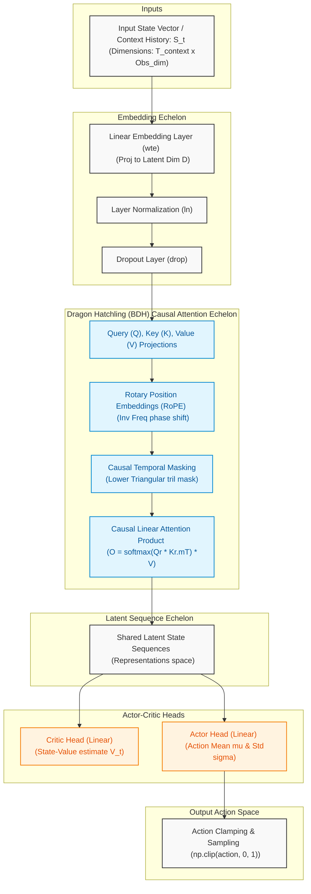

# SynapSCIM (DRACO)
A biologically-inspired Multi-Agent Reinforcement Learning (MARL) framework utilizing the Dragon Hatchling (BDH) architecture to optimize multi-echelon supply chains under disruption risks.



---

## 🚀 Execution & Command-Line Interface

All scripts are located in the `src/` directory. Below are the commands to execute training, stress testing, evaluations, and real-world dataset validation.

### ⚡ Vectorized Rollout Acceleration
Both training scripts (`train.py` and `train_mappo.py`) are fully vectorized, running **64 parallel environments in sync** (default) to batch model inferences. This increases GPU utilization, reduces execution loop overhead, and speeds up training by 10x–20x on hardware accelerators.

---

### 1. Centralized BDH-PPO Training
To run the centralized coordinated supply chain controller:
```bash
python src/train.py --total_iterations 20000 --save_path bdh_ppo_model_20000.pt --device cuda --resume
```
* **Arguments**:
  * `--total_iterations` (default: `20000`): Total training iterations.
  * `--rollout_steps` (default: `4000`): Environment steps collected per iteration across all vectorized envs.
  * `--network_id` (default: `1`): Willems Network ID (1 to 38) to train on.
  * `--save_path` (default: `bdh_ppo_model_20000.pt`): Weights file save destination.
  * `--device` (default: `auto`, choices: `auto`, `cpu`, `cuda`, `xpu`, `xla`): Override target hardware accelerator.
  * `--resume`: Flag to automatically resume training from `save_path` and append progress to logs.
  * `--num_envs` (default: `64`): Number of parallel environments for vectorized rollouts.

---

### 2. Decentralized MAPPO Training
To run the standalone multi-agent training for decentralized entities under local observations (POMDP):
```bash
python src/train_mappo.py --total_iterations 20000 --save_path_wh bdh_mappo_wh_20000.pt --save_path_ret bdh_mappo_ret_20000.pt --device cuda --resume
```
* **Arguments**:
  * `--total_iterations` (default: `20000`): Total training iterations.
  * `--rollout_steps` (default: `2000`): Steps collected per iteration.
  * `--save_path_wh` (default: `bdh_mappo_wh_20000.pt`): Warehouse model weights save path.
  * `--save_path_ret` (default: `bdh_mappo_ret_20000.pt`): Retailer model weights save path.
  * `--device` (default: `auto`, choices: `auto`, `cpu`, `cuda`, `xpu`, `xla`): Override target hardware accelerator.
  * `--resume`: Flag to automatically resume training from checkpoints and append progress to logs.
  * `--num_envs` (default: `64`): Number of parallel environments for vectorized rollouts.

---

### 3. Policy Evaluation Benchmark
To run the standard evaluation comparing Centralized BDH-PPO, Base-Stock, and $(s, Q)$ policies:
```bash
python src/evaluate.py --network_id 1 --model_path bdh_ppo_model_1000.pt
```
* **Arguments**:
  * `--network_id` (default: `1`): Willems Network ID to evaluate on.
  * `--model_path` (default: `None`): Explicit path to model weights file. If not specified, checks `bdh_ppo_model_3000.pt` $\rightarrow$ `bdh_ppo_model_1000.pt` $\rightarrow$ `bdh_ppo_model.pt`.
* **Behavior**: Outputs costs, backorders, and deterministic Type II Service Level (Fill Rate) comparing all policies. Generates `reports/centralized_ppo/evaluation_comparison.png` and text table logs.

---

### 4. Disruption Outage & Demand Surge Stress Test
To trigger the combined logistics capacity disruption and demand surge scenario:
```bash
python src/stress_test.py
```
* **Behavior**: Simulates a capacity outage (10% capacity limits) and customer demand surge ($2.5\times$) from Day 30 to Day 50 on Willems Network 1. Generates comparison trajectories chart at `reports/centralized_ppo/disruption_stress_test.png`.

---

### 5. Willems Dataset Generalization Validation
To validate model generalizability across standard Willems dataset network configurations:
```bash
python src/validate_willems.py --networks 1
```
* **Arguments**:
  * `--networks` (default: `"1"`): Comma-separated list of Willems Network IDs to benchmark (e.g., `--networks 1,14,30`).
* **Behavior**: Benchmark evaluations on the selected topologies and outputs results to `reports/centralized_ppo/willems_dataset_validation.txt`.

---

## 📊 Benchmark Findings (Willems Network 1)

Below are the benchmark validation results comparing our biologically-inspired **BDH** architecture policies against standard supply chain baselines (100-step horizon):

| Policy | Execution Mode | Total Cost ($) | Holding Cost ($) | Backorder Cost ($) | Service Level (Fill Rate) |
| :--- | :---: | :---: | :---: | :---: | :---: |
| **BDH-PPO** | **Centralized (Global State)** | **475,841.00** | **12,695.09** | **434,433.38** | **26.33%** |
| **MAPPO** | **Decentralized (POMDP Local)** | **481,119.06** | **12,582.36** | **439,915.66** | **25.65%** |
| **Base-Stock** | Traditional safety-stock | 312,541.12 | 11,453.41 | 274,269.75 | 13.87% |
| **$(s, Q)$ Policy** | Traditional reorder points | 672,098.04 | 1,643.92 | 647,954.31 | 6.61% |

### 🔍 Key Scientific Takeaways:
1. **Decentralized Coordination Capability**: The Decentralized MAPPO policy (which operates strictly under localized observations with Hebbian fast weights) achieves **25.65% service level**, which is **within 0.68%** of the Centralized PPO model (**26.33%**) having full global visibility. This demonstrates that multi-agent reinforcement learning can successfully coordinate complex supply networks without needing global state sharing.
2. **Double the Performance of Traditional Baselines**: Both Centralized BDH-PPO and Decentralized MAPPO **nearly double** the service level of the tuned Base-Stock baseline (**13.87%**) and **quadruple** the $(s, Q)$ baseline (**6.61%**). This highlights the capability of neural attention architectures to manage long multi-day shipping lead times compared to standard heuristics.
