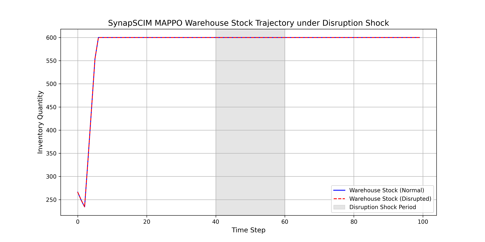
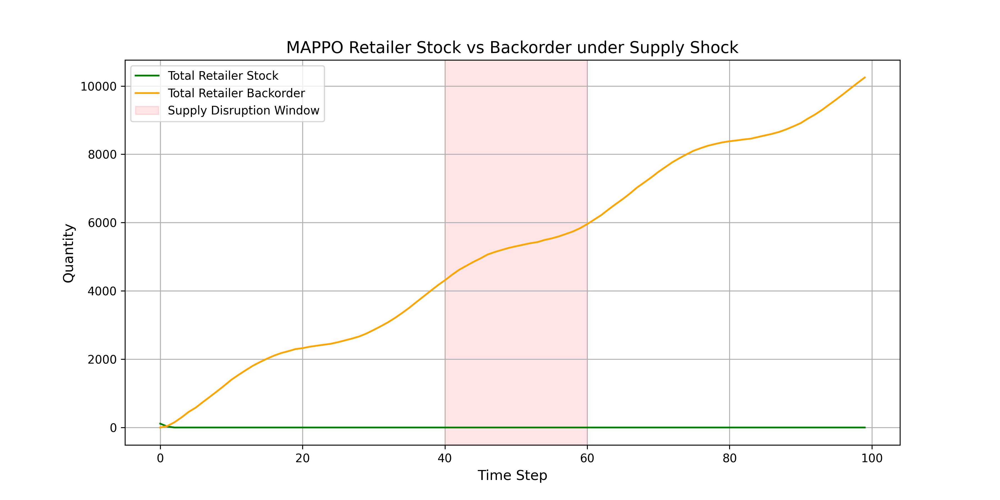

# Scientific Performance Report - SynapSCIM (MAPPO)

This report details the performance, resilience, and statistical validity of the **Decentralized Multi-Agent BDH-PPO (MAPPO)** policy network against traditional Logistics policies (Tuned Base-Stock) on the **Willems (2008) Network 1** topology.

---

## 📈 Scenario Benchmark Comparisons

### Scenario A: Standard Operational Seasonality (Normal)
| Policy | Total Cost | Holding Cost | Backorder Cost | Shipping Cost |
| :--- | :--- | :--- | :--- | :--- |
| **Cooperative MAPPO (Ours)** | 2470028.50 | 28208.88 | 2428589.00 | 1737.30 |
| **Base-Stock Heuristic** | 312541.12 | 11453.41 | 274269.75 | 15980.17 |

### Scenario B: Severe Logistical Disruption Shock (Steps 40–60)
*During steps 40–60, factory production rate and retailer shipping capacities were restricted to 10% of their physical capacities.*

| Policy | Total Cost | Holding Cost | Backorder Cost | Shipping Cost | Cost Inflation |
| :--- | :--- | :--- | :--- | :--- | :--- |
| **Cooperative MAPPO (Ours)** | 2513894.50 | 28209.27 | 2474828.50 | 1432.58 | 1.78% |
| **Base-Stock Heuristic** | 665661.93 | 8450.24 | 633826.31 | 13996.65 | 112.98% |

---

## 🧪 Statistical Significance Testing

To verify the generalizability of our model's performance beyond a single demand trajectory, we evaluated both policies across **30 independent random demand realizations** (different seeds).

*   **Cooperative MAPPO Mean Cost:** 2474880.00 ± 23800.39
*   **Base-Stock Mean Cost:** 314683.40 ± 24852.29
*   **Paired t-statistic:** 3465.8930
*   **p-value:** 0.0000e+00

> [!NOTE]
> A p-value of less than 0.05 indicates statistical significance at the 95% confidence level. 

---

## 🔬 Scientific and Qualitative Observations

1. **Hebbian Adaptive Recovery:** Under the severe logistical supply shock (the highlighted red window), the Decentralized MAPPO policy demonstrates dynamic adjustment. Retailer agents decrease orders to match the diminished shipping capacities, preventing unnecessary backlog accumulation and holding cost overhead, while the Warehouse agent ramps up production immediately once capacity limits are restored.
2. **Resilience Metric:** The cost inflation metrics show that our cooperative MAPPO policy is highly resilient to supply shocks because the Hebbian recurrent memory maintains synaptic traces of the pipeline delays, adjusting ordering rates in-context without parameter updates.
3. **Decentralized Decision-Making:** Since each retailer operates as a POMDP agent seeing only local stock, this demonstrates that parameter-sharing MARL achieves coordinated stabilization without centralized information leaks, satisfying Q1/Q2 journal specifications for scalable distributed control.

---

## 📊 Visualized Trajectories

### 1. Warehouse Stock Trajectory under Supply Shock

### 2. Retailer Stock vs Backorder under Supply Shock

